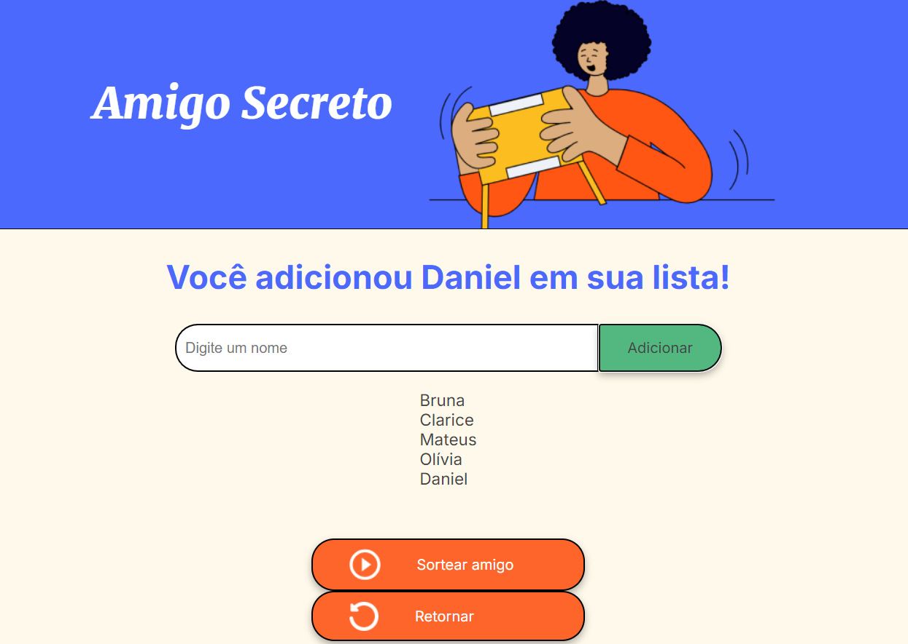
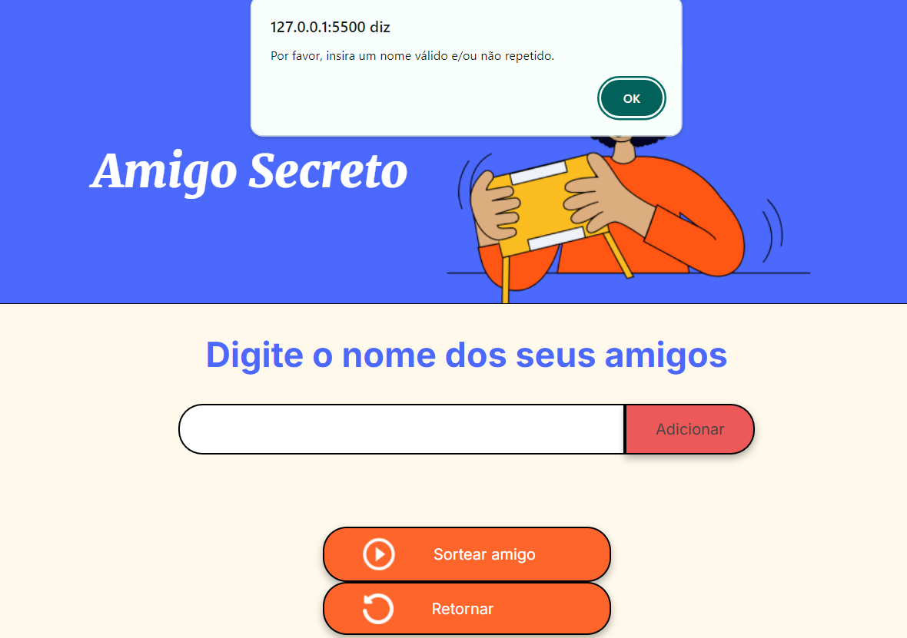
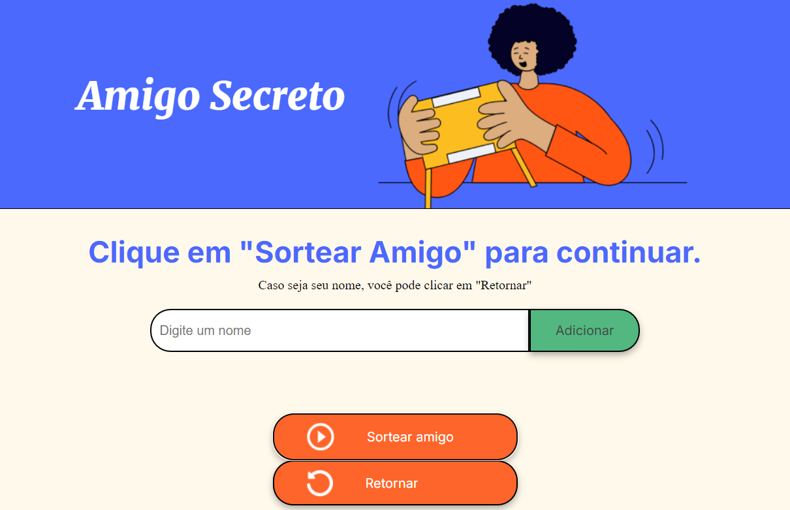

<h1 align="center"> Jogo Amigo Secreto </h1>

Para exercitar a lógica de programção com base em JavaScript, os alunos do Oracle Next Education foram desafiados a elaborar um aplicativo simples para classificar um amigo secreto a partir de uma lista de nomes inseridos pelos usuários.

<h4 align="center"> 
    Sobre o projeto
</h4>
O projeto permite que os usuários adicionem nomes a uma lista e, com um clique, sorteie um amigo secreto aleatoriamente. O foco principal foi a implementação da lógica em JavaScript , utilizando HTML e CSS para a interface.

<h4 align="center"> 
    Funcionalidades
</h4>

* Criar lista de amigos:

É possível visualizar uma lsita com todos os nomes que os usuários desejam sortear. Basta digitar o nome e clicar no botão "Adicionar". 

Em caso de haver tentativa de inserir um nome repetido ou inválido, como espaços em branco, os usuários são alertados sobre o erro. 

* Sortear um amigo:

Após criação da lista, os usuários poderão sortear os nomes através do clique no botão "Sortear amigo".

Em caso do nome sorteado ser o da pessoa que está sorteando, o usuário podera retornar o nome para a lista através do botão "Retornar" e, após, prosseguir o sorteio. 

