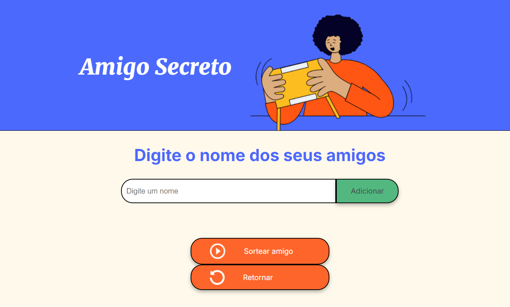

<h1 align="center"> Jogo Amigo Secreto </h1>

Para exercitar a lógica de programção com base em JavaScript, os alunos do Oracle Next Education foram desafiados a elaborar um aplicativo simples para classificar um amigo secreto a partir de uma lista de nomes inseridos pelo usuário.

<h4 align="center"> 
    Sobre o projeto
</h4>
O projeto permite que o usuário adicione nomes a uma lista e, com um clique, sorteie um amigo secreto aleatoriamente. O foco principal foi a implementação da lógica em JavaScript , utilizando HTML e CSS para a interface.

